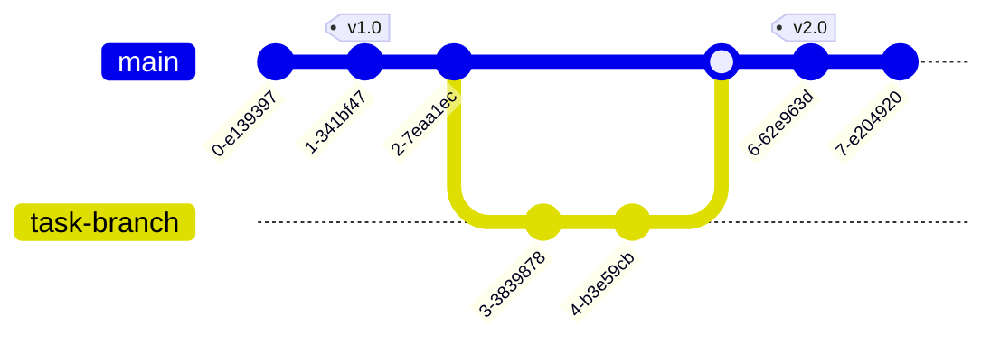

# System architecture


Khi vào ứng dụng, người dùng sẽ vào [on.duty.vn](https://on.duty.vn) để login và chọn business, sau khi chọn business sẽ dc chuyển sang trang dành cho business đó `business_name.duty.vn`.
Mỗi phần nhỏ của ứng dụng sẽ được traefix điều hướng sang các microservice frontend khác nhau, ví dụ:
```
business_name.duty.vn/hr -> fe-hr
business_name.duty.vn/tax/report -> fe-tax
business_name.duty.vn/workspace -> fe-workspace
```
Mỗi microservice backend sẽ có một database riêng lưu những dữ liệu liên quan, nếu một microservice khác cần dữ liệu đó sẽ gọi grpc qua để lấy, ko lưu cùng một dữ liệu ở 2 microservice.

# Git flow



Khi làm một tính năng mới, tạo một branch với tên ở định dạng `mã-task-tên-tính-năng`, ví dụ `pwf-1410-new-hr-tab`.
Sau khi xong tính năng tạo PR để merge vào `main`.
Khi cần release thì sẽ tạo một release mới để build artifact.
